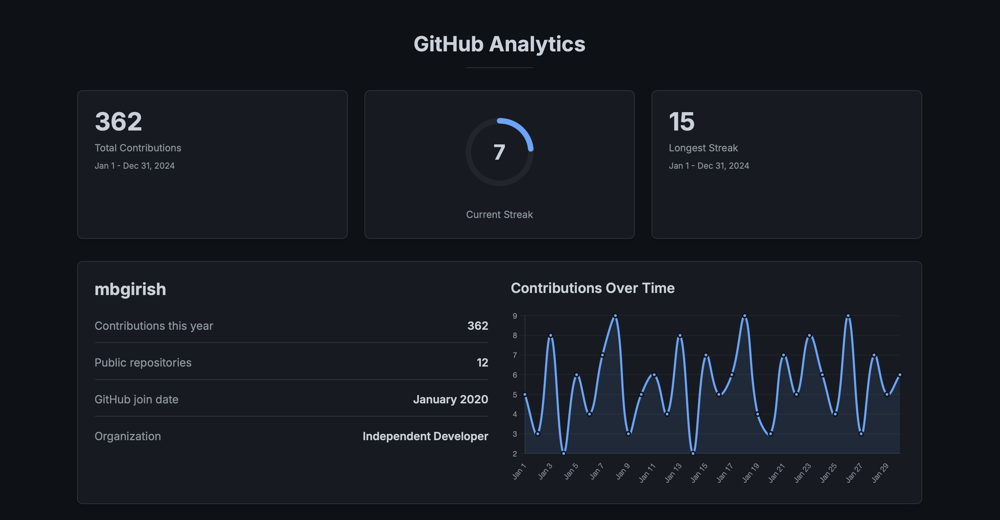

  

<h1 align="center">👋 Hi, I’m M B Girish</h1>

  <b>Data Scientist & Machine Learning Engineer</b> 
  Building production-grade ML systems with a focus on monitoring, causal inference, and decision intelligence 
  📍 Bangalore, India

  
  
  
  
  
  

---

## 🧠 About Me

I design **end-to-end machine learning systems** that go beyond model accuracy — focusing on **reliability, interpretability, and real-world decision impact**.

My work includes:
- ML system design, monitoring & drift detection  
- Causal inference, uplift modeling & experimentation  
- Product analytics & decision intelligence  
- Applied AI across healthcare, finance & consumer platforms  

---

## 🛠️ Tech Stack

**Programming:**  
Python, SQL, TypeScript  

**Machine Learning & Data Science:**  
Scikit-learn, PyTorch, TensorFlow  
Pandas, NumPy, SciPy  
XGBoost, LightGBM  
Time Series: ARIMA, SARIMA, Prophet  

**ML Systems & Analytics:**  
Model Monitoring & Drift Detection  
Causal Inference & Uplift Modeling  
A/B Testing & Experimentation  

**Databases & Tools:**  
PostgreSQL, MySQL  
Git, GitHub, Jupyter  
Docker (basic)  

---

  

  

---

  <i>Good models predict. Great systems decide.</i>

